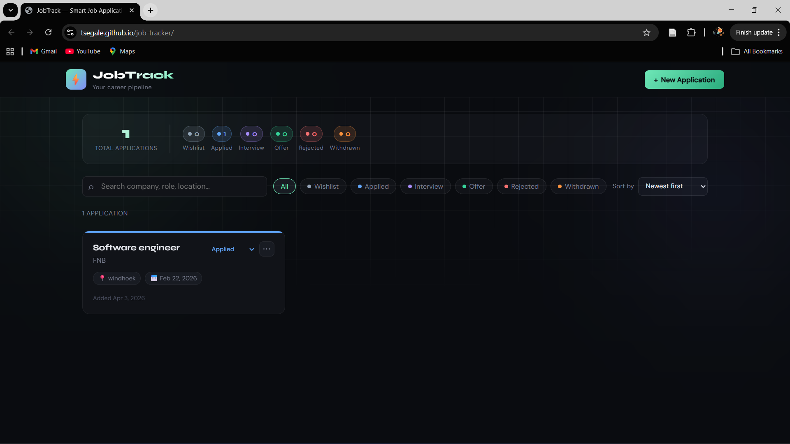
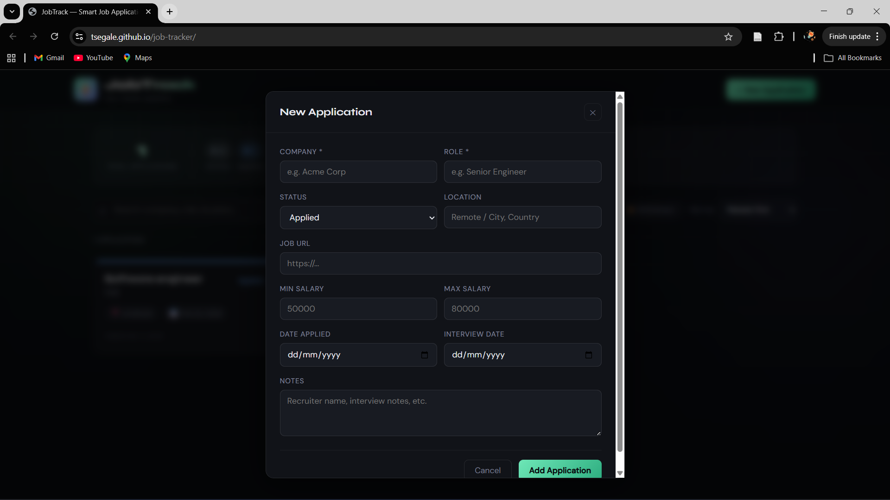

# ◈ Smart Job Tracker (Full-Stack Web Application)

> A full-stack job tracking platform built with React and Django REST Framework to manage job applications, track progress, and analyze outcomes.

## 🔗 Live Demo

👉 https://tsegale.github.io/job-tracker/

---

## 🚀 Features

- Full CRUD operations for job applications
- Track application status (Applied, Interview, Offer, Rejected)
- Smart filtering and keyword search
- Real-time statistics (total, active, offers, rejected)
- Responsive UI with dynamic updates
- RESTful API powering frontend interactions

---

## 🛠 Tech Stack

**Frontend**

- React (Vite)
- JavaScript
- CSS

**Backend**

- Django
- Django REST Framework

**Database**

- SQLite (development)
- PostgreSQL-ready (production)

**Deployment**

- Railway (backend)
- GitHub Pages (frontend)

---

## 📸 Screenshots

```md


```

⚙️ How It Works

- Backend exposes REST API endpoints for managing job data
- Frontend consumes API using dynamic React components
- Application state updates in real-time based on user actions
- Filtering and search are handled client-side for responsiveness

🧠 Key Concepts Demonstrated
-Full-stack architecture (frontend + backend separation)
-REST API design and integration
-CRUD operations and data flow
-State management in React
-Deployment across multiple platforms
-Environment configuration and CORS handling

🚀 Getting Started

Backend

- cd backend
- pip install -r requirements.txt
- python manage.py migrate
- python manage.py runserver

Frontend

- cd frontend
- npm install
- npm run dev

📌 Future Improvements

- User authentication (JWT)
- Personalized dashboards
- Email notifications for application updates
- Analytics and insights (success rate, trends)

📄 License

MIT © 2026
